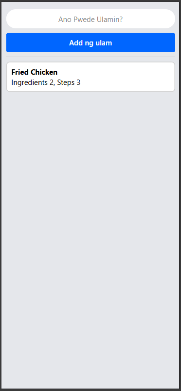
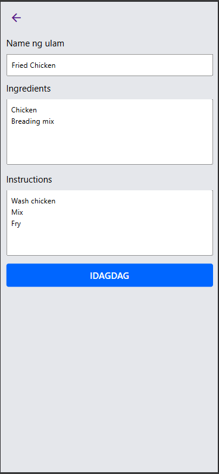
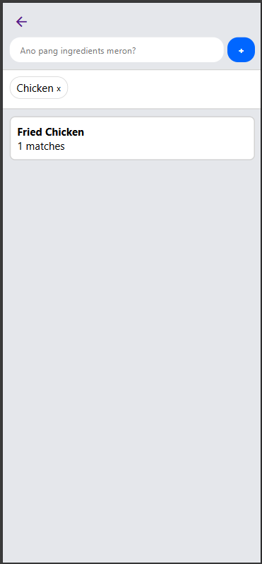
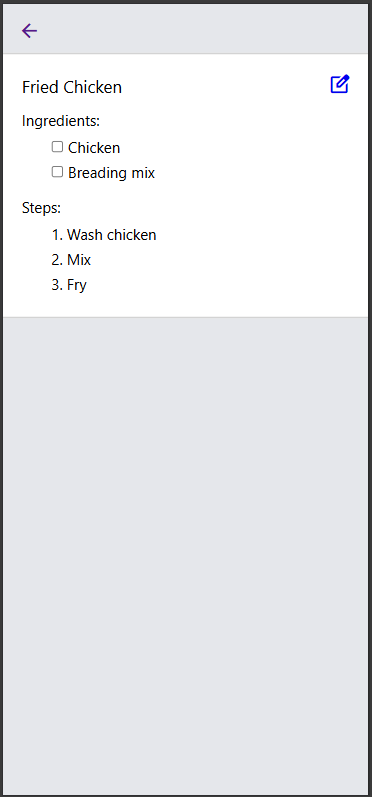
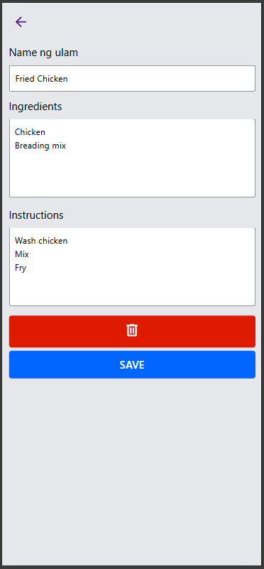

# Ulalam Vanilla js

Recipe management application that helps answer **"Ano kaya ang lulutuin kong ulam?"** by recommending recipes from your collection based on the ingredients you already have. Users can add, edit, and delete recipes, along with their ingredients and cooking instructions.

## Live Demo
[▶ https://ulalam-vanilla-js.netlify.app/](https://ulalam-vanilla-js.netlify.app/)

## Demo Video
[▶ Watch the demo](https://youtube.com/shorts/bRbSBn-wFC8)

## Screenshots

## Features
- Search for ulams based on the ingredients you already have
- Browse your ulam collection
- Add new ulams to your collection
- Edit ulam names, ingredients, and cooking instructions
- Delete ulams from your collection

## Tech Stack

### Frontend
- HTML5
- CSS3
- JavaScript (ES6)

### Storage
- Local Storage

### Tools
- Git
- Github

## Future Improvements
- Migrate application to MERN stack
- Add authentication
- Allow users to browse other users' ulam collections in their feed and searches
- Add a guided cooking mode with step-by-step instructions
- Provide autocomplete suggestions when seaching ulam collection using available ingredient
- Add like/heart, bookmark, cook ulam features